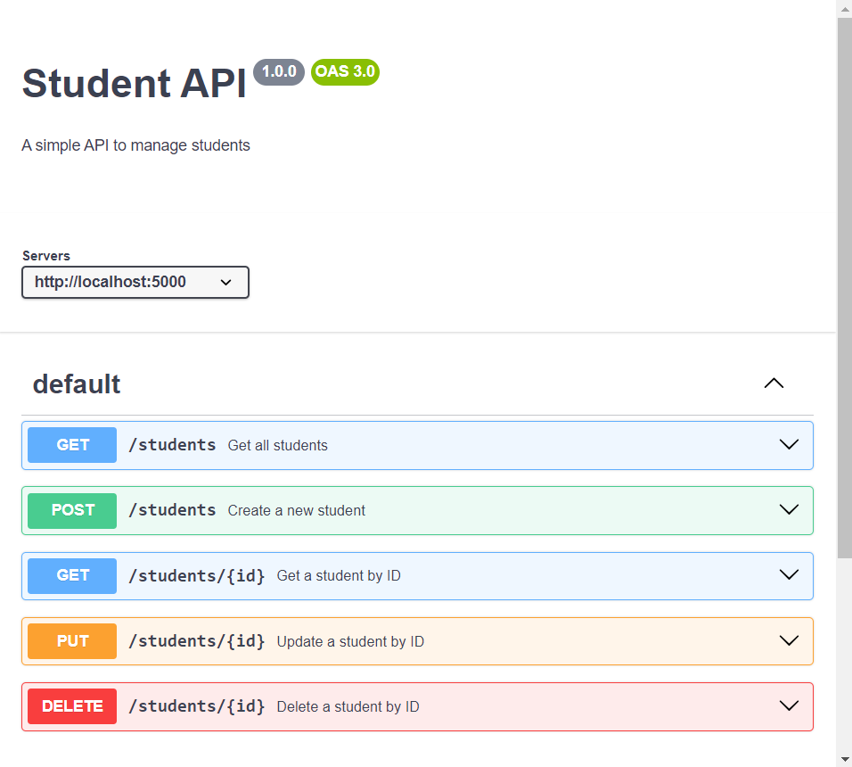

# Flask_RESTful_API

This API provides basic CRUD operations for managing students.

## API Endpoints:

- **GET** `/students`: Fetch all students.
- **GET** `/students/{id}`: Fetch a specific student by ID.
- **POST** `/students`: Create a new student.
- **PUT** `/students/{id}`: Update an existing student.
- **DELETE** `/students/{id}`: Delete a student by ID.

## Postman Collection:

[Click here to view the Postman collection](https://drive.google.com/file/d/1sUM-z6Bfx4NFel9N761cs6bh7F4dCpe-/view?usp=sharing)

## Swagger Documentation:

()
()
())
())
())
())

## Installation:

1. Clone the repo.
2. Run `pip install -r requirements.txt` to install the dependencies.
3. Run the application with `flask run` to start the server.
